# EasyTrip Bus Ticket System — DFD Level 1

```mermaid
flowchart TB
    subgraph ExternalEntities["External Entities"]
        PASSENGER[("👤 Passenger")]
        ADMIN[("🔧 Admin")]
        OPERATOR[("🏢 Operator")]
        STAFF[("👥 Staff")]
        SSLCOMMERZ[("💳 SSLCommerz")]
        EMAIL[("📧 Email Service")]
    end

    subgraph System["EasyTrip Bus Ticket System"]
        P1["1.0\nAuthentication\nProcess"]
        P2["2.0\nTrip Search &\nDiscovery"]
        P3["3.0\nBooking\nProcess"]
        P4["4.0\nPayment\nProcess"]
        P5["5.0\nRefund\nProcess"]
        P6["6.0\nOperator &\nStaff Dashboard"]
        P7["7.0\nPlatform\nManagement"]
        P8["8.0\nReal-time\nSeat Sync"]
    end

    subgraph DataStores["Data Stores"]
        D1[(D1\nUsers)]
        D2[(D2\nOperators)]
        D3[(D3\nBuses)]
        D4[(D4\nRoutes)]
        D5[(D5\nBoarding/\nDropping Points)]
        D6[(D6\nTrips)]
        D7[(D7\nSeats)]
        D8[(D8\nBookings)]
        D9[(D9\nBookingSeats)]
        D10[(D10\nPayments)]
        D11[(D11\nRefunds)]
    end

    %% ====== 1. Authentication Process ======
    PASSENGER -- "register/login credentials" --> P1
    P1 -- "user tokens" --> PASSENGER
    P1 -- "user profile" --> PASSENGER
    P1 -- "read/write user" --> D1
    PASSENGER -- "forgot/reset password" --> P1
    P1 -- "reset email" --> EMAIL
    ADMIN -- "view/manage users" --> P1

    %% ====== 2. Trip Search & Discovery ======
    PASSENGER -- "search query (origin, dest, date)" --> P2
    P2 -- "trip results + seat map" --> PASSENGER
    P2 -- "read operators" --> D2
    P2 -- "read routes" --> D4
    P2 -- "read buses" --> D3
    P2 -- "read trips" --> D6
    P2 -- "read seats" --> D7
    P2 -- "read booking seats" --> D9
    P2 -- "read boarding/dropping points" --> D5

    %% ====== 3. Booking Process ======
    PASSENGER -- "lock seats (no auth)" --> P3
    P3 -- "lock confirmation" --> PASSENGER
    PASSENGER -- "confirm booking (auth)" --> P3
    P3 -- "booking confirmed" --> PASSENGER
    P3 -- "read/write bookings" --> D8
    P3 -- "read/write booking seats" --> D9
    P3 -- "read trips" --> D6
    P3 -- "read seats" --> D7
    P3 -- "read users" --> D1
    P3 -- "read boarding/dropping points" --> D5

    STAFF -- "manual booking (no timeout)" --> P3
    P3 -- "confirmed booking" --> STAFF

    %% ====== 4. Payment Process ======
    PASSENGER -- "initiate payment" --> P4
    P4 -- "payment URL" --> PASSENGER
    PASSENGER -- "redirect" --> SSLCOMMERZ
    SSLCOMMERZ -- "success/cancel/fail callback" --> P4
    P4 -- "payment status" --> PASSENGER
    P4 -- "send ticket email" --> EMAIL
    P4 -- "read/write payments" --> D10
    P4 -- "update booking status" --> D8
    P4 -- "update seat status" --> D9

    %% ====== 5. Refund Process ======
    PASSENGER -- "cancel booking / request refund" --> P5
    P5 -- "refund status / amount" --> PASSENGER
    P5 -- "read/write refunds" --> D11
    P5 -- "read/write bookings" --> D8
    P5 -- "read payments" --> D10
    P5 -- "process refund" --> SSLCOMMERZ
    ADMIN -- "approve/reject refund" --> P5
    OPERATOR -- "approve/reject refund" --> P5

    %% ====== 6. Operator & Staff Dashboard ======
    OPERATOR -- "manage buses, routes, trips" --> P6
    P6 -- "dashboard data" --> OPERATOR
    STAFF -- "manage bookings" --> P6
    P6 -- "dashboard data" --> STAFF
    P6 -- "CRUD buses" --> D3
    P6 -- "CRUD routes" --> D4
    P6 -- "CRUD trips" --> D6
    P6 -- "CRUD staff" --> D1
    P6 -- "CRUD boarding/dropping points" --> D5
    P6 -- "read/write bookings" --> D8
    P6 -- "read payments" --> D10
    P6 -- "read/write refunds" --> D11
    P6 -- "read operators" --> D2
    P6 -- "read stats" --> D8
    P6 -- "read stats" --> D6

    %% ====== 7. Platform Management ======
    ADMIN -- "manage operators" --> P7
    ADMIN -- "manage users" --> P7
    ADMIN -- "platform stats" --> P7
    P7 -- "platform data" --> ADMIN
    P7 -- "CRUD operators" --> D2
    P7 -- "CRUD users / roles" --> D1
    P7 -- "read buses (all operators)" --> D3
    P7 -- "read routes (all operators)" --> D4
    P7 -- "read trips (all operators)" --> D6
    P7 -- "read bookings (all)" --> D8
    P7 -- "read payments (all)" --> D10
    P7 -- "read refunds (all)" --> D11

    %% ====== 8. Real-time Seat Sync ======
    PASSENGER -- "WebSocket subscribe (tripId)" --> P8
    P8 -- "seat update broadcasts" --> PASSENGER
    P8 -- "read seat locks" --> D9
    P8 -- "read seat status" --> D7
    P3 -- "seat locked/released" --> P8
    P4 -- "payment success (seat reserved)" --> P8
```

## Data Flow Description

| Process | Description | Key Data Flows |
|---------|-------------|----------------|
| **1.0 Authentication** | Handles user registration, login, token refresh, password reset, and profile management | Credentials → JWT tokens, user profile data |
| **2.0 Trip Search & Discovery** | Public search for trips by origin/destination/date with filters. Shows seat maps for trip details. | Search params → filtered trip list with availability |
| **3.0 Booking Process** | Two-step process: (a) Lock seats (no auth) creates temporary hold, (b) Confirm booking (JWT) creates PENDING booking with payment deadline. Dashboard manual booking for staff. | Seat IDs → lock confirmation → booking reference |
| **4.0 Payment Process** | Creates SSLCommerz payment session, handles gateway callbacks (success/fail/cancel), updates booking/seat status, sends ticket PDF via email | Booking ID → payment URL → gateway callback → status update |
| **5.0 Refund Process** | Passenger cancels booking → refund request created with % calculation based on time. Admin/operator approve/reject. SSLCommerz refund sync. | Cancel request → refund % → approval/rejection → gateway sync |
| **6.0 Operator & Staff Dashboard** | Full CRUD for bus company resources: buses, routes, trips, boarding/dropping points, staff accounts. Booking management with manual booking for walk-in passengers. | CRUD commands → resource updates, dashboard stats |
| **7.0 Platform Management** | ADMIN manages operators (create/suspend/activate), users (role changes), views read-only data across all operators with platform-level stats. | Operator CRUD, user role changes, cross-tenant read queries |
| **8.0 Real-time Seat Sync** | WebSocket gateway (`/seat-sync`) that broadcasts seat availability changes to subscribed clients when locks/reservations/releases occur. | WebSocket subscribe/unsubscribe → broadcast seat-update events |

## External Entity Summary

| Entity | Role | Interactions |
|--------|------|-------------|
| **Passenger** | End-user who searches, books, pays, and manages tickets | Processes 1, 2, 3, 4, 5, 8 |
| **Admin** | Platform owner managing operators and users | Processes 1, 5, 7 |
| **Operator** | Bus company managing their fleet and business | Processes 5, 6 |
| **Staff** | Operator employee managing walk-in bookings | Processes 3, 6 |
| **SSLCommerz** | External payment gateway | Processes 4, 5 |
| **Email Service** | Sends transactional emails (reset password, tickets) | Processes 1, 4 |
